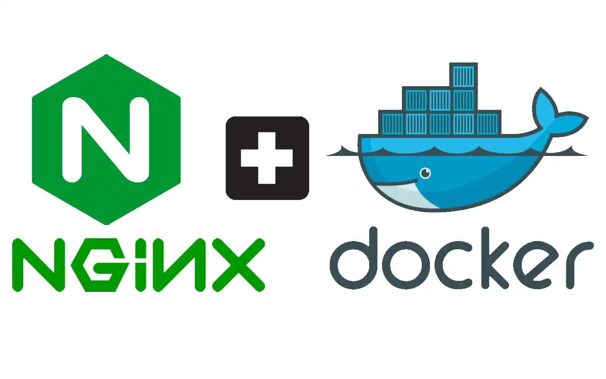

# FullCycle Challenge - Node + NGINX with Docker

This is a resolution from the FullCycle challenge of docker module. This challenge consist in set up a Dockerized Node.js server with an Nginx reverse proxy.

## Installation

Make shure that you have instaled [Docker](https://www.docker.com/) and `docker-compose` before started.

## Usage

Clone repository:

```bash
git clone https://github.com/larabeatrizms/fc-challenge-docker-go.git
```

Running project:

```bash
docker-compose up
```

---

> GitHub [@larabeatrizms](https://github.com/larabeatrizms) &nbsp;&middot;&nbsp;
> Twitter [@larabeatrizms](https://twitter.com/LaraBeatrizMS)
